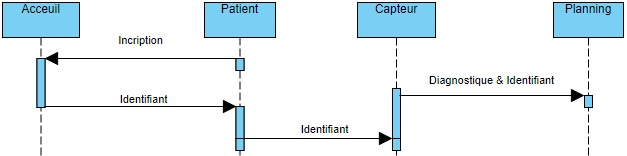
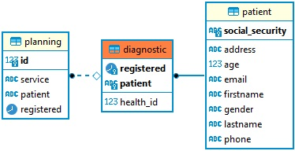
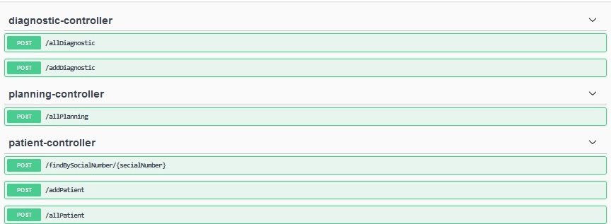
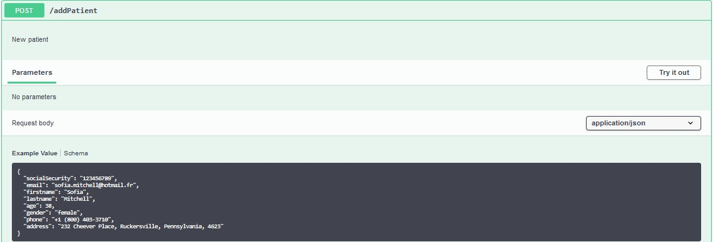
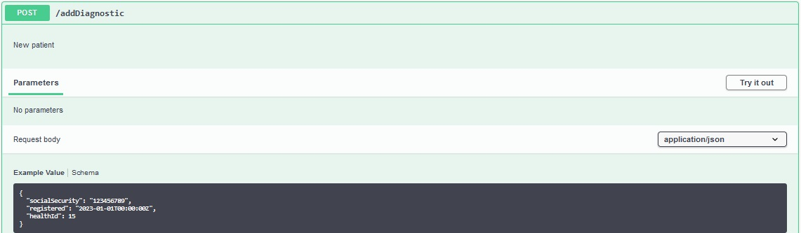
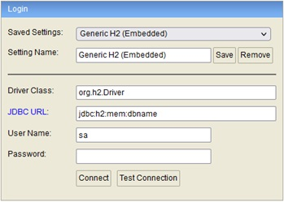

# PATHOLOGY SORTING


## 1. Objectif

L'objectif est de développer une application capable de consigner les données renvoyées par une cabine _d'auto-diagnostic_ d'un centre hospitalier.<br>
Le paramètre _d'auto-diagnostic_ renvoyé par la cabine est une valeur numérique ( ou _index de santé_ ) permettant de déterminer la pathologie du patient.<br>
Les pathologies renvoyées par la cabine sont soit __cardiaques__ soit __traumatologiques__ .

Le patient peut avoir soit l'une ou l'autre des pathologies soit les deux :
- Un _index de santé_ multiple de __3__ indique un problème __cardiaque__ .
- Un _index de santé_ multiple de __5__ indique un problème __traumatologique__ .
- Un _index de santé_ multiple de __3 et de 5__ indique les __deux pathologies à la fois__ .


## 2. Analyse

### 2.1. Scénario & flux de données

Le __patient__ se présente à __l'accueil__ du centre hospitalier afin d'établir un dossier de prise en charge, en fournissant l'ensemble des informations de la table précitée ( _numéro de sécurité sociale, nom, prénom, adresse,_ ... ).<br>
L'accueil lui affecte un identifiant ( _numéro de sécurité_ ).<br>

Le __capteur__ récupère l'identifiant du __patient__ puis détermine sa/ses __pathologie(s)__ .<br> 
Une fois la pathologie déterminé le capteur renverra le paramètre _d'index de santé_ et la date de l'examen du patient.<br>
L'envoi des informations du capteur automatisera la __planification__ d'une date de rendez-vous avec un médecin spécialiste (non définie dans le modèle de données).

  




### 2.2. Model de données

L'application est chargée de __planifier__ la/les consultation(s) d'un __patient__ avec un/des médecin(s) spécialiste(s) selon le/les __diagnostic(s)__ établi(s) par la cabine  _d'auto-diagnostic_ .
Le modèle de données proposé est le suivant :



<br>

>Pour des raisons de simplification du modèle de données, de cette évaluation, le médecin spécialiste ainsi que la date de consultation ne seront pas définies au niveau de la __panification__ .<br>


### 2.3. Mise en œuvre

L'interaction entre le capteur, la base de données et l'affichage du planning sera obtenue grâce à l'exploitation _d'APIs_ Rest.<br>
On partira du principe que le capteur _d'auto-diagnostic_ est capable d'envoyer des requêtes _http_ et de demander le rafraichissement de l'écran chaque fois que des données de diagnostics d'un patient seront consignées en base de données.<br>
Le développement sera réalisé en _Java Sping boot, JPA_ . Les données seront consignées dans une base de données _PosgreSQL_ .

Les services seront suivants :<br>




L'ensemble des étapes du scénario ci-dessus peut être concrétisé par la succession de trois requêtes _http_ :
- 1. Ajout d'un nouveau patient
- 2. Affectation d'une/de pathologie(s) d'un patient précédemment enregistré
- 3. Affichage du planning des patients 

#### 2.3.1. Enregistrement d'un nouveau patient

La première étape est l'ajout d'un nouveau patient.<br>
L'identifiant unique du patient sera son numéro de sécurité sociale (ex. _"socialSecurity": "123456789"_ ).



#### 2.3.2. Affectation d'une ou des pathologie(s) au patient

Une fois le patient enregistré et identifié par son numéro de sécurité sociale (ex. _"socialSecurity": "123456789"_ ), on pourra lui diagnostiquer sa/ses pathologie(s) selon _l'index de santé_ .<br>
L'identifiant unique du diagnostic est établi par le numéro de sécurité sociale du patient (ex. _"socialSecurity": "123456789"_ ) et sa date d'examen ( _"registered": "2023-01-01T00:00:00Z"_ ).<br>

Dans cet exemple, _l'index de santé_ du patient ( _"healthId": 15_ ) doit renvoyer les deux pathologies.





#### 2.3.3. Planning des patients

Pour des raison de simplification, cette application d'évaluation affichera la totalité du planning quel que soit le patient.


## 3. Exploitation

### 3.1 Démarrage du serveur

A partir d'une console une console _Ms Dos,_ se positionner dans le répertoire du projet ( _PathologySorting_ ) puis lancer la commande _maven._


```bash
mvn clean package spring-boot:run
```

### 3.2 Interface API

Les fonctionnalités de l'application pourront être testées via [l'interface web](http://localhost:8080/swagger-ui/index.html?configUrl=/pathology-sorting-openapi/swagger-config)
 mise à disposition par le _framwork._ <br>
 Le serveur est configuré avec le port 8080 (cf. _application.yaml_ ).


### 3.3 Base de données

Le projet est configuré pour interagir avec une [base de données H2](http://localhost:8080/h2-console) (cf. _application.yaml_ ).<br>  



